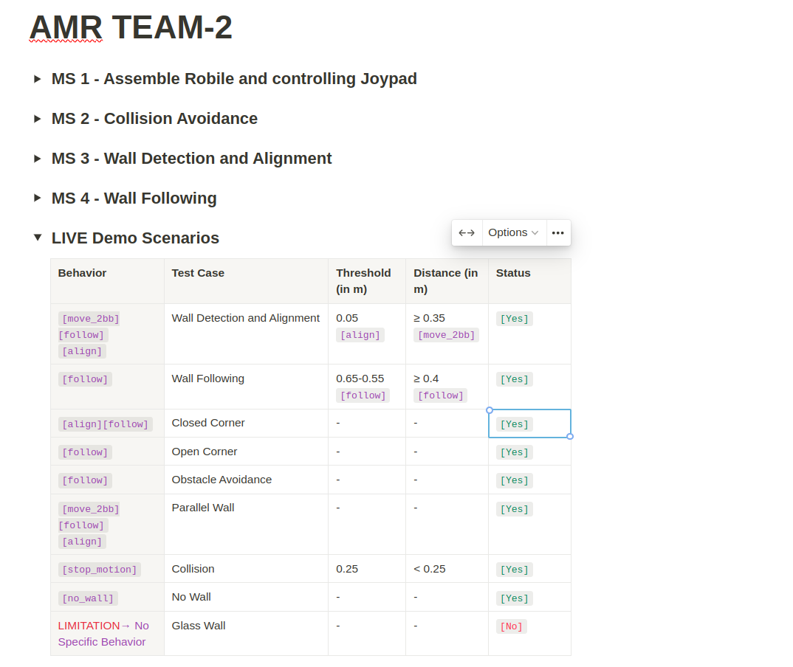

# AMR_Robile_Team2
- ROS2 project involving advanced algebra algorithms for
  - Wall following
  - Aligning to wall
  - Avoiding collisions
- [Documentation](https://www.notion.so/shaxpy/AMR-TEAM-2-e0c2091d62ba4ed791275f145d655237?pvs=4)
- 
- 
